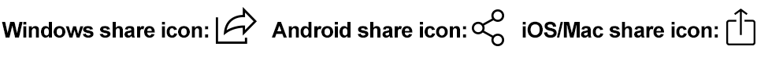

# Progressive Share Button

The Progressive Share Button web component is a simple way to add a share button to your web page. The button will only be displayed if the browser supports the [Web Share API](https://w3c.github.io/web-share/).

The web component is a wrapper around the [Web Share API](https://w3c.github.io/web-share/) that attempts to display a share icon appropriate to the user's device with icons that will be recognizable to iOS/Mac, Android and Windows.

## Limitations

The [Web Share API](https://w3c.github.io/web-share/), while still in draft, has wide support on mobile. Desktop support is decent on Windows. Mac support works in Safari, but lags on third-party browsers. Check [caniuse/web-share](https://caniuse.com/web-share) for the most up-to-date information.

The component will only display the share button if the browser supports the Web Share API. If the browser does not support the Web Share API, the component will not display anything.

Progressive Share Button does not support Web Share API Level 2, which allows for the sharing of files.

The current version of this component supports sharing a URL, title and text. It does not support sharing files.


## Basic Usage

The most basic usage of the component is to pass the URL to be shared. The component will render a share icon that will open the native share dialog when clicked.

```html
Basic Example: <progressive-share-button url="https://example.com" />
```

This will render one of the following, depending on the device and browser. This example shows the Windows sharing icon, the Android sharing icon, and the iOS sharing icon.



## Customizing the Component

The component accepts the following attributes:

| Attributes | Type | Default | Description |
| --- | --- | --- | --- |
| title | string | null | The title of the page to be shared. |
| text | string | null | The text string to be shared. |
| url | string | null | The URL to be shared. |
| smart-share | boolean | false | Accepts 0, false, 1, or true. If true, the component concatenate the title, text, and url into a single string. See the [_Why use smart-share_](#why-use-smart-share) section below for more information. |
| icon-size | string or int | 24 | The size of the SVG share icon. The icon is rendered in a square. If an integer is passed, the component assumes the value is given in pixels, 24 becomes "24px", but you may also pass a string with a valid CSS size, like "1rem". |
| debug | boolean | false | Accepts 0, false, 1, or true. If true is passed, the share icon will be displayed even if the Web Share API is not supported in the browser. The share behavior will *not* open the share dialog but, but instead will pass the data to be shared to the console for debugging. |
## Styling

The component uses the [Shadow DOM](https://developer.mozilla.org/en-US/docs/Web/Web_Components/Using_shadow_DOM) to encapsulate the styles. This means that the styles are not inherited by the parent page. To style the component, you must use the [::part()](https://developer.mozilla.org/en-US/docs/Web/CSS/::part) pseudo-element. There are two parts that can be styled: `shareButton` and `shareIcon`.

### shareButton

The `shareButton` part is the button that is displayed when the Web Share API is supported. The button is a [button](https://developer.mozilla.org/en-US/docs/Web/HTML/Element/button) element. The button has the following default styles:

```css
button {
  background: none;
  border: none;
  padding: 1px 2px 1px 2px;
  margin: 0;
  cursor: pointer;
}
```

### shareIcon

The `shareIcon` part is the icon that is displayed when the Web Share API is supported. The icon is an [svg](https://developer.mozilla.org/en-US/docs/Web/SVG) element. The icon has the following default styles:

```css
svg {
  width: 24px;
  height: 24px;
  fill: currentColor;
  vertical-align: bottom;
}
```

## Usage Examples

### Basic Usage

```
<progressive-share-button  url="https://example.com" />
```

### Usage with Text


```
<progressive-share-button url="https://example.com" class="text-share-example-1">Share this link</progressive-share-button>

<style>
progressive-share-button.text-share-example-1::part(shareButton) {
      font-size: 1rem;
      text-decoration: underline;
      color: blue;
    }
</style>
```

### Advanced Usage with Options

```
<progressive-share-button
  title="Progressive Share Button Web Component"
  text="Check out this cool web component that creates a share button that will only be displayed if the browser supports the Web Share API."
  url="https://example.com"
  smart-share=1
  icon-size="20"
  debug=0
/>
```

## Why use smart-share

The Web Share API requires that the data to be shared be passed as an object with the following optional properties:

* title
* text
* url

The *Progressive Share Button* web component by default simply passes your data to the Web Share API, like this:

```
{
  title: 'Example Page',
  text: 'This is an example page.',
  url: 'https://example.com'
}
```

The problem is that when multiple properties are passed as separate properties what actually gets shared doesn't always include all the pieces of data you pass into the API. Some devices and applications receiving the data object will only share a single property, most often the URL in my tests.

If have `smart-share` set to true, the component will concatenate all of the data into a single string and pass it to the Web Share API as text. The `title` and `text` will have a period added at the end of the string if it is not present. This will allow the data to be shared on any device or application that supports sharing text. The data will be shared as a single string, like this:

```
{
  text: 'Example Page. This is an example page. https://example.com'
}
```

The following link lets you test the Web Share API on your devices to make a more informed decision as to what option works best for your use case.

https://w3c.github.io/web-share/demos/share-files.html

## Installation

### NPM

```
npm install johnfmorton/progressive-share-button
```

### CDN

https://unpkg.com/

```html
<script src="https://unpkg.com/TBD/progressive-share-button"></script>
```


## Usage
main.js, if installed with npm
```javascript
import { ProgressiveShareButton } from 'progressive-share-button';
customElements.define('progressive-share-button', ProgressiveShareButton);
```

main.js, if installed with CDN
```javascript
import { ProgressiveShareButton } from 'https://unpkg.com/TBD/progressive-share-button';
customElements.define('progressive-share-button', ProgressiveShareButton);
```

index.html
```html
<progressive-share-button url="https://example.com"></progressive-share-button>

<progressive-share-button url="https://example.com" icon="share.svg" apple-icon="share-ios.svg" android-share="share-android.svg" text="Share this article"></progressive-share-button>
```
## Demo

[https://johnfmorton.github.io/progressive-share-button/](https://johnfmorton.github.io/progressive-share-button/)
## License

MIT

## Author

[John F. Morton](https://johnfmorton.com)
